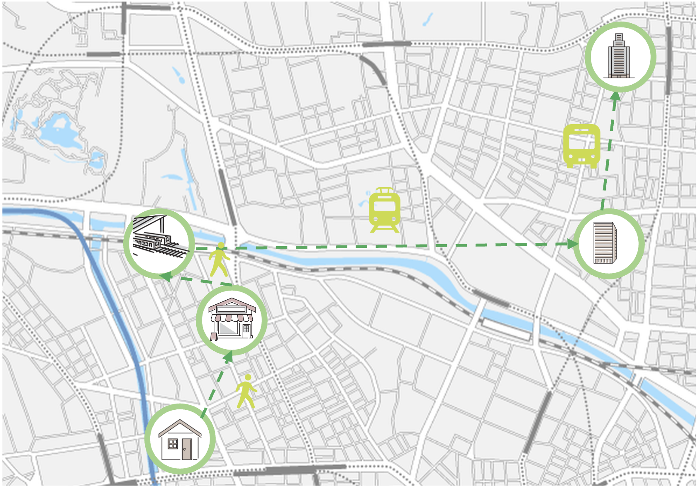

# バス移動判定クエリ

## 1. 概要
本リポジトリでは、Project PLATEAUの令和6年度のユースケース開発業務の一部であるUC24-05「高精度観光動体システムの社会実装」について、その成果物である「バス移動判定ロジック」のソースコードを公開しています。

「バス移動判定クエリ」は、スマートフォン端末より取得した人流データをもとに、移動ログの交通手段がバスで移動したかどうかを判定するロジックを実装したサンプルクエリです。

## 2. 「バス移動判定ロジック」について 
「高精度観光動態分析システム」では、観光スポットへの入込客数や交通手段、観光消費額等の観光動態を解像度高く把握し、観光施策立案に有効活用することを目的としてシステムを開発しました。
本ロジックは、システムの構成機能のひとつである「観光客の交通手段判定機能」のひとつであり、スマートフォン端末の移動履歴とバス路線情報やバスの移動履歴情報をもとに、車等または自転車等と判定された移動の中でバスに該当するものを判定しています。
本ロジックは、オープンソースソフトウェアとしてフルスクラッチで開発されています。\
本システムの構築手順及び利用手順については[技術検証レポート](https://www.mlit.go.jp/plateau/file/libraries/doc/plateau_tech_doc_0100_ver01.pdf)を参照してください。

## 3. 利用手順
本システムの構築手順及び利用手順については[利用チュートリアル](https://project-plateau.github.io/Bus-Tourism-Estimator/)を参照してください。

## 4. ロジック概要
- バスプローブデータと移動ログの2点間の距離を計算し、300m以内にバスプローブデータがあれば、バスに乗っている可能性が高いと判断してフラグを付与
- 移動ログがバス路線上に検出された場合、バス乗車の可能性が高いと判断してフラグを付与
- 移動ログの総数のうち、バスフラグが付与されたログの比率が0.75以上ならバスと判定
- 1～3の条件でバスと判定できなかった場合でも、100m以内で同じ時間帯に3人以上が2回以上同じ動きをしていたら、バスと判定

## 5. 利用技術

| 種別              | 名称   | バージョン | 内容 |
| ----------------- | --------|-------------|-----------------------------|
| ソフトウェア       | [Google Bigquery](https://cloud.google.com/bigquery?hl=ja) |  |コードの実行 |
| ライブラリ      | [Geopandas](https://geopandas.org/en/stable/) |1.0.1 |空間データ（Shapefileなど）の操作や解析を行うためのライブラリ |
| ライブラリ      | [Shapely](https://shapely.readthedocs.io/en/stable/) |2.0.6 |ジオメトリ操作（WKT変換、空間演算など）を行うためのライブラリ |

## 6. 動作環境 <!-- 動作環境についての仕様を記載ください。 -->
| 項目               | 最小動作環境                                                                                                                                                                                                                                                                                                                                    | 推奨動作環境                   |
| ------------------ | ----------------------------------------------------------------------------------------------------------------------------------------------------------------------------------------------------------------------------------------------------------------------------------------------------------------------------------------------- | ------------------------------ |
| OS                 | Windows 10 以降または Windows Server 2016 以降 MacはmacOS Big Sur 11 以降は                                                                                                                                                                                                                                                                                                                 |  同左 |
| CPU                | Intel Pentium 4 以降                                                                                                                                                                                                                             | 同左              |
| メモリ             | 4GB以上                                                                                                                                                                                                                                                                                                                                         | 8GB以上                        |
| ディスプレイ解像度 | 1920×1080以上上                                                                                                                                                                                                                                                                                                                                    |  同左                   |
| ネットワーク       | 【判定ロジック実行】インターネット環境へ接続されていることが必要|  同左                            |

## 7. 本リポジトリのフォルダ構成 <!-- 本GitHub上のソースファイルの構成を記載ください。 -->
| フォルダ名 |　詳細 |
|-|-|
| input | インプットデータが含まれているフォルダ |
| query | バス判定ロジック |
| output | 出力結果のサンプル |

## 8. ライセンス <!-- 変更せず、そのまま使うこと。 -->

- ソースコード及び関連ドキュメントの著作権は国土交通省に帰属します。
- 本ドキュメントは[Project PLATEAUのサイトポリシー](https://www.mlit.go.jp/plateau/site-policy/)（CCBY4.0及び政府標準利用規約2.0）に従い提供されています。

## 9. 注意事項 <!-- 変更せず、そのまま使うこと。 -->

- 本リポジトリは参考資料として提供しているものです。動作保証は行っていません。
- 本リポジトリについては予告なく変更又は削除をする可能性があります。
- 本リポジトリの利用により生じた損失及び損害等について、国土交通省はいかなる責任も負わないものとします。

## 10. 参考資料 <!-- 技術検証レポートのURLはアクセンチュアにて記載します。 -->
- 技術検証レポート: https://www.mlit.go.jp/plateau/file/libraries/doc/plateau_tech_doc_0030_ver01.pdf
- PLATEAU WebサイトのUse caseページ「カーボンニュートラル推進支援システム」: https://www.mlit.go.jp/plateau/use-case/uc22-013/
