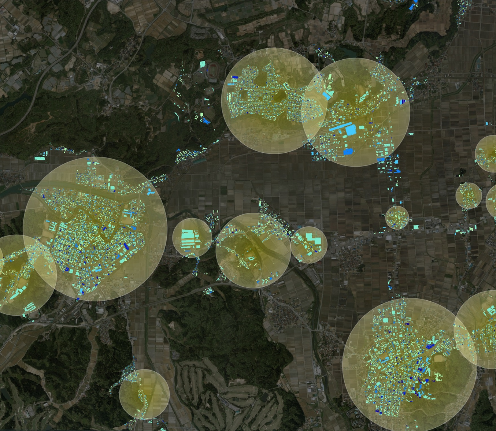
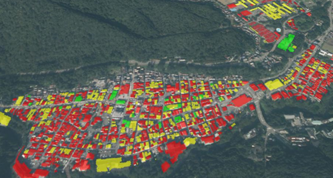

# カーボンニュートラル施策推進支援システム

P本リポジトリでは、Project PLATEAUの令和6年度のユースケース開発業務の一部であるUC24-05「高精度観光動体システムの社会実装」について、その成果物である「観光客交通手段判定(バス)」のソースコードを公開しています。

「観光客交通手段判定(バス)」は、スマートフォン端末より取得した人流データをもとに、移動ログの交通手段がバスで移動したかどうかを判定するロジックです。

